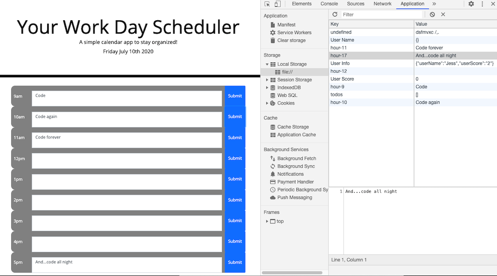

## Build a web Daily planner

Create a simple calendar application that allows the user to save events for each hour of the day. This app will run in the browser and feature dynamically updated HTML and CSS powered by jQuery.

### What I did

``
Once the app opened in the browser, it features dynamically updated HTML and CSS (using Jquery).
I used Bootstrap components to build this responsive layout.
Local storage is used to stored the data, even after refreshing the page.

I attempted to create the divs through JS, the code was partially working, only needed to figure out how to populate with correct time of the working hours.

``

### Project screenshots

## Project submissions

- The URLs of the deployed applications:
  https://jessicaperez1.github.io/Your-Day-Planner/

- The URLs of the GitHub repositories:
  https://github.com/JessicaPerez1/Your-Day-Planner.git
