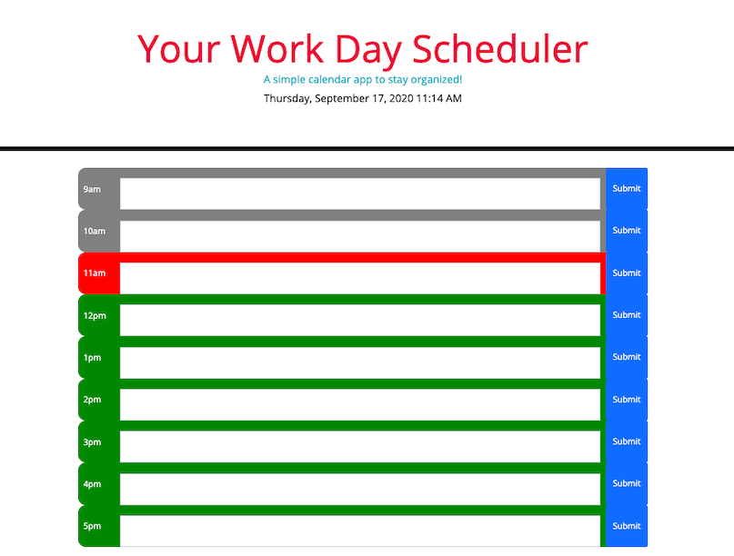

## Your Daily Planner

Create a simple calendar application that allows the user to save events for each hour of the day. This app will run in the browser and feature dynamically updated HTML and CSS powered by jQuery.

### What I did

Local storage is used to stored the data, even after refreshing the page and Bootstrap makes the app responsive.
Current time of the day will be colored in red, past in grey and future in green.

### Project screenshot

## Project submissions

- [Deployed app](https://jessicaperez1.github.io/Your-Day-Planner/)

- [GitHub link](https://github.com/JessicaPerez1/Your-Day-Planner.git)
